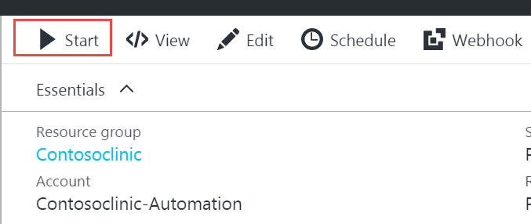
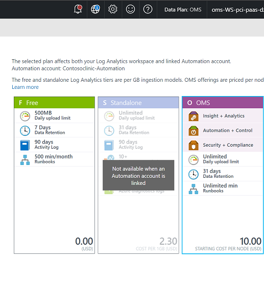
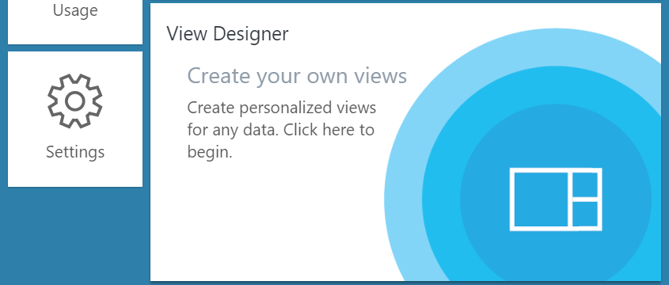
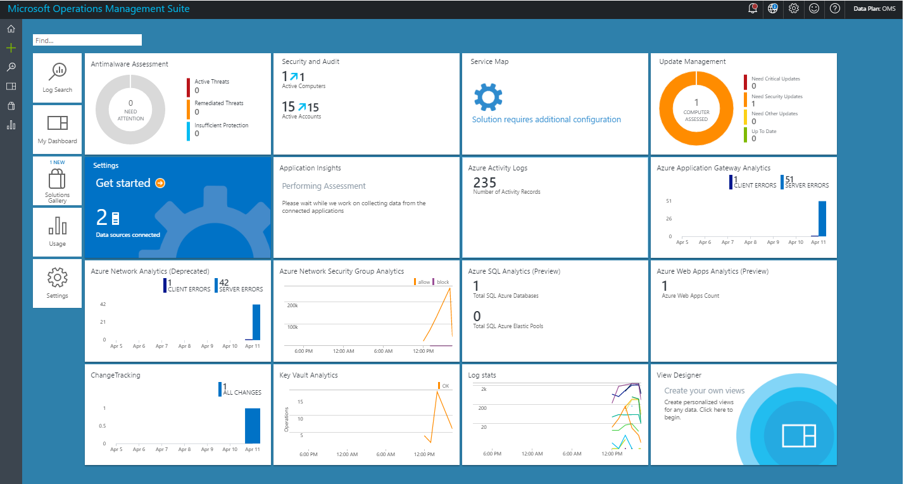

# POC and data set deployment

The following provides details to manage user level experience of the deployed solution. This portion of the deploment helps illustrate how the database, users, and data records help meet the PCI DSS compliance process. The steps in this section will illustrate how record protection requirements are enabled by encrypting the customer records that contain payment card data, and monitoring can be set up to collect logs, and maintain security.


## Testing SQL Transparent Data Encryption (TDE)

At this point you will have a fully deployed solution, to which the two administrative user roles will be added. The user roles can be deployed using SQL Management Studio.

Open SQL Server Management Studio using the Active Directory username and password.

In our example: `sqladmin@contosowebstore.onmicrosoft.com`


The following connection information should be used to connect to your SQL
Server Management Studio:

-   Server Type:` Database Engine`

-   Server name: Your server string. In this example:

    `contosowebstore.onmicrosoft.com`

-   Authentication: **Use Active Directory Password Authentication**

-   Username: The AD SQL user account you set up in pre-deployment. In our
    example:  `sqladmin@contosowebstore.onmicrosoft.com`

-   Password: The password for your AD SQL user account. In this example:

    `your PASSWORD`

-   Create a new query and run the following command to see the customer records
    secured

```SQL
    SELECT * FROM [dbo].[customers]
```

You will need to edit the `PostDeploymentSQL.sql` script under the
pre-post-deployment folder

-   Replace `XXXX` with your AD domain name. In our example:

   `contosowebstore.onmicrosoft.com`

You can copy the script from the deployment file and run it in a new SQL query.


## Enabling Logging and Monitoring

The following sections address security controls that are required to enable
extensive logging, monitoring, security detection, and anti-malware protection.

#### Operations Management Suite (OMS) configuration

During the deployment step, OMS scripts were created and installed. In this
configuration step, the OMS instance is configured.

>**NOTE**: Pricing default **free** tier, will not be sufficient for this solution
to operate correctly, you will be required to change to the **OMS tier**.

#### Start the collection for OMS

1.  Sign in to the Azure Portal with an account that is a member of the
    Subscription Admins role and co-administrator of the subscription.

2.  Click **Automation Accounts**.

3.  In the Automation Accounts blade, select your automation. For example:
    **contosowebstore-Automation**

4.  In Process Automation, click **Runbooks**. For example:
    **contosowebstore-Automation – Runbooks**

5.  Select the **scheduleIngestion** runbook that was installed by the
    post-installation script.

6.  Click **Start** to launch the OMS data intake runbook.

7.  Click **Yes**

    

8.  Return to your runbook blade

9.  Select the **sqlAzureIngestion** runbook that was installed by the
    post-installation script.

10.  Click **Start** to launch the OMS data intake runbook.

11.  Click **Yes**

12.  Return to your runbook blade

13.  Select the **webAzureIngestion** runbook that was installed by the
    post-installation script.

14.  Click **Start** to launch the OMS data intake runbook.

15.  Click **Yes**

#### Upgrade your OMS instance


1.  Sign in to the Azure Portal with an account that is a member of the
    Subscription Admins role and co-administrator of the subscription.

2.  Click **Log Analytics**.

3.  Click **Pricing Tier**.

4.  Select **Per Node (OMS)** plan to continue with this solution.
    

5.  Click **Ok**


#### Install OMS Dashboards view

Installing the OMS Dashboard view requires deployment of the scripts located in
the `./omsDashboards` folder.

>**NOTE:** OMS Dashboard will not install correctly, until has collected information for a period of time. If you receive an error when running the dashboard import it is due to the lack of collected data. It is recommended that you wait up to 10 minutes to guarantee data is available in OMS.

1.  Open **Log Analytics**.

2.  Select your OMS Log Analytics in your list of items. In this example:
    `oms-WS-pci-paas-dzwhejjrwbwdy`

3.  Click **Log Analytics**.

4.  Click **OMS Portal**.

    

5.  The Microsoft Operations Management Suite will open in a new browser window,
    or tab.

    

6.  Click **View Designer** on your Microsoft Operations Management Suite home
    page.

    

7.  In the designer, select **import**.

8.  For the SQL monitoring solution, import the file with OMSSQL in the file
    name. In this example:
    \\omsDashboards\\OMSSQLDBAzureMonitoringSolution.omsview

9.  Select **Save**.

    

10. Repeat steps 8 through 11 for the web application monitoring solution;
    import the file with OMSWebApp in the file name. In this example:
    \\omsDashboards\\OMSWebAppAzureMonitoringSolution.omsview

The monitoring configuration of your SQL server, database, and webapps is now
complete.

You can now review your data collection in OMS.



### Upgrade Azure Security Center review Security Advisor messages

Azure Security Center was enabled in the deployment of your subscription.
However, to ensure that the antimalware and threat detection capabilities are
enabled, you will need to enable the solution with a standard tier data plan.

1.  Sign in to the Azure Portal with an account that is a member of the
    Subscription Admins role and co-administrator of the subscription.

2.  Click **Security Center**.

3.  Click the banner that reads “Your security experience may be limited. Click
    here to learn more.”

4.  Select your subscription.

5.  Click **Pricing tier**.

6.  Select the **Standard tier – Free Trial**.

7.  Click **Select**.

You can review additional information about Azure Security Center in the
[getting started
guidance](https://docs.microsoft.com/en-us/azure/security-center/security-center-get-started).

Complete the instructions at this link
<https://docs.microsoft.com/en-us/azure/security-center/security-center-get-started>
to enable data collections from Azure Security Center.

[Azure Advisor](https://docs.microsoft.com/en-us/azure/advisor/advisor-overview) Advisor is a 
personalized cloud consultant that helps you follow best practices to optimize your Azure deployments.
 It analyzes your resource configuration and usage telemetry and then recommends solutions that can help you 
 improve the cost effectiveness, performance, high availability, and security of your Azure resources. 
 1. Select **Browse**, and then scroll to **Azure Advisor**. 
 2. The Advisor dashboard displays personalized recommendations for Contoso webstore subscription.
 

**NOTE:**

>   Currently, the OMS Monitoring agent is automatically installed along with
>   the Bastion Host deployment. In this solution, the Security Center VM agent
>   is not deployed; the reason is to prevent OMS conflict issues.


### To Enable Kudu Access

The Web App service is within a VNET that is not publicly accessible. To deploy new service capabilities such as a Kudu console, you require a Virtual Machine within the same Virtual Network that has access to the Web App. internal IP. 

You will also need to establish a DNS service that will resolve the Web App specific domains. This can be done by creating an **A-record** 
that resolves to the App Service Environment's Internal Load Balancer **IP address**, and you will need to include Cnames for the following 
> *, *.scm, ftp, publish 

If you are deploying this solution in an isolated environment which does not have access to DNS server, You can create a Virtual Machine that is hosted in the Virtual Network and update its host file mapping to include the App Service Environment's Internal Load Balancer
**IP address**. For example: 

> ` 10.10.0.73	www.contosowebstore.com	www.scm.contosowebstore.com`	

Verify your connection for Kudu by browsing to your domain name, In our example we browse to: 
-    `http://www.contosowebstore.com`.

    1.  Note that this verification will be limited till the  post-deployment process is completed.
